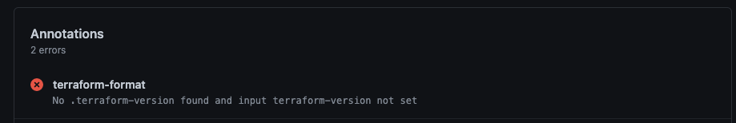

# terraform-format-action

GH Action to check terraform fmt, optionally fix and push commit.

By default the action checks for terraform formatting problems, passing the
check if none found or errors, failing the check if there are issues.

As auto commits can be annoying and cause issues with workflow triggering
from automatic commits, we don't fix problems by default, if you want that
set the fix-format input to true. Then if it finds terraform formatting
issues it will fix those by running terraform format, then commit and push
those changes using the author of the triggering commit. Note that the pushed
commit will **not** trigger a new run of this workflow (a protection in the
actions system against loops).

## Outputs

### commit-id

If you set the `fix-format` to `true`, this gets set to the ID of the commit it creates. You can test for this:
```yaml
  - name: Terraform Format Action
    uses: fac/terraform-format-action@devp/v2
    id: tf-fmt
    with:
      terraform-version: "0.12.30"
      fix-format: true
  - name: do something if we fixed formatting
    if: steps.tf-fmt.outputs.commit-id
    run: echo the autofix commit ID is ${{ steps.tf-fmt.outputs.commit-id}}
```

## Inputs

### terraform-version

Set the version of terraform to install and check formatting for. Useful if there is no .terraform-version file in the repo or you want to override for some reason, like testing an upgrade.

```yaml
  - name: Terraform Format Action
    uses: fac/terraform-format-action@devp/v2
    with:
      terraform-version: "0.12.30"
```

### fix-format

Defaults to false, set to true to have the action push auto commits fixing formatting errors found.

## Usage

As this action may modify the workspace when fixing formatting issues it is recommended that you run it as it's own workflow job. To check the format:

```yaml
on:
  push:
jobs:
  terraform-format:
    runs-on: ubuntu-latest
    steps:
      - uses: actions/checkout@v2

      - name: Terraform Format Action
        uses: fac/terraform-format-action@v2
```

If you want auto fixing and commits pushing you most likely want this running on branches and PR, so the final merges have good formatting but not on your main branch as auto commits may trigger other effects such as deploys. If so use you can set that up with:

```yaml
on:
  push:
    branches-ignore:
    - $default-branch
jobs:
  terraform-format:
    runs-on: ubuntu-latest
    steps:
      # v2 and with.ref ensures we checkout a branch and not detached, as we might push.
      - name: Checkout
        uses: actions/checkout@v2
        with:
          ref: ${{ github.head_ref }}

      - name: Terraform Format Action
        uses: fac/terraform-format-action@v2
        with:
          fix-format: true
```

## Errors

If there is no `.terraform-version` file found and no terraform-version input set the run will fail:



If formatting fails the check, that appears in the summary, you can click through to see the diff.


